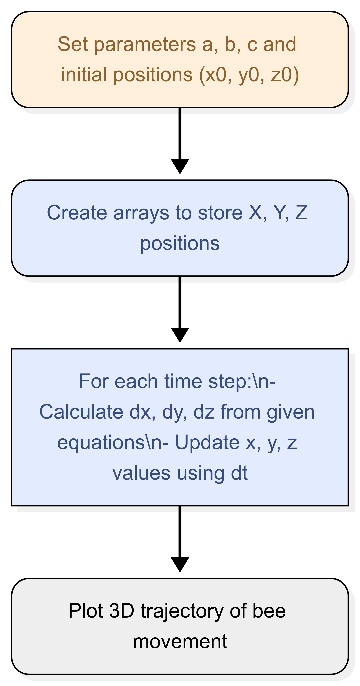

## Flowchart

  

## Why this method
The equations are non-linear and have no closed-form solution, so a numerical approach is necessary.

Euler’s method is simple, efficient for visualisation, and easy to implement for small time steps (dt=0.01).

## Results
The simulation generated a chaotic 3D trajectory, typical for Lorenz attractor-type systems.

With num_steps = 5000 and dt = 0.01, the bee’s path exhibits smooth motion in 3D space.

Results match expected chaotic dynamics with looping paths.

Increasing dt causes numerical instability, producing unrealistic motion — this is a limitation of Euler’s method.

The simulation is deterministic: same initial conditions always produce the same trajectory.
