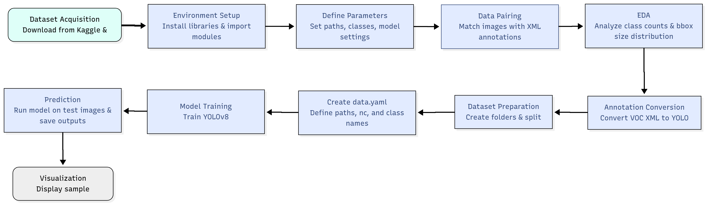

## VEHICLE DETECTION USING YOLOV8
## Flowchart

  

## Chosen Classes
This project focuses on detecting the following vehicle classes:

Car

Bus

Motorbike

Rickshaw

## Why YOLOv8

YOLOv8(You Only Look Once) is selected due to its excellent balance of accuracy and speed. As a single-stage object detector, YOLOv8 processes images in real-time, making it ideal for vehicle detection applications such as traffic monitoring and autonomous systems. The model benefits from state-of-the-art architecture improvements, allowing it to accurately detect multiple vehicle classes in diverse and complex scenes while maintaining efficient inference.

## Results Discussion

The trained YOLOv8 model was evaluated on 751 test images containing nearly 4,000 object instances across four vehicle classes (car, bus, motorbike, rickshaw). The model achieved a strong overall precision of 78.1% and recall of 65.5%, with a mean average precision (mAP@50) of 72%, indicating reliable detection performance.

Class-wise, the bus and car classes showed higher precision and mAP, likely due to their more distinctive features and better representation in the dataset. The motorbike and rickshaw classes had relatively lower accuracy, which may be attributed to class imbalance and more challenging visual characteristics like smaller size or occlusion.

Training for 50 epochs provided a good balance, allowing the model to generalize well without overfitting. The inference speed was efficient, processing each image in under 10 milliseconds, demonstrating suitability for real-time applications.

Visual inspection of sample predictions confirmed that the model accurately detected vehicles in most cases, with occasional misclassifications likely caused by poor image quality or class similarities.

Overall, the results validate YOLOv8 as an effective choice for multi-class vehicle detection in real-world scenarios.
