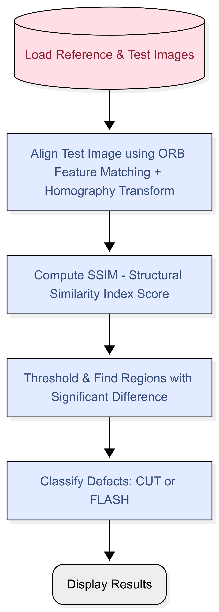

## Flowchart

  

## WHY THIS ALGORITHM:
ORB Feature Matching is lightweight, fast, and works well for grayscale industrial images. It handles small rotations, translations, and scale differences.

Homography Alignment ensures both reference and test images are in the same perspective, making defect detection accurate even with camera shifts.

SSIM (Structural Similarity Index) captures structural changes rather than pixel-by-pixel differences, making it robust against lighting variations.

Thresholding & Contour Detection helps to isolate defect regions for further classification.

Simple Intensity-Based Classification (CUT vs FLASH) is computationally cheap and interpretable for industrial inspection.

## RESULTS AND DISCUSSION:
The results show high SSIM values (~0.9993–0.9994), indicating minimal structural differences from the reference image, yet defects were detected: FLASH in defect1 and defect4, CUT in defect2 and defect3, with defect1 having two instances of FLASH.
